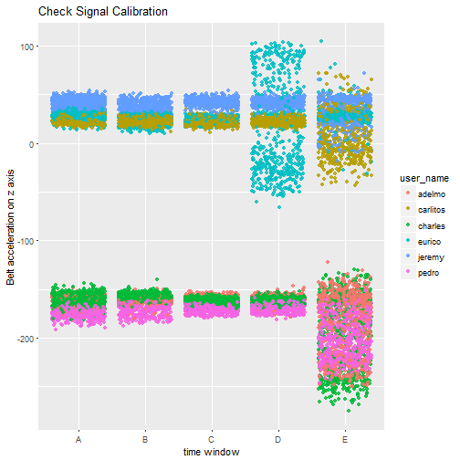
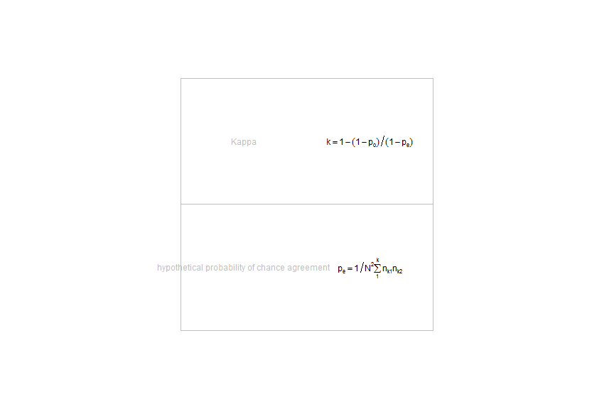
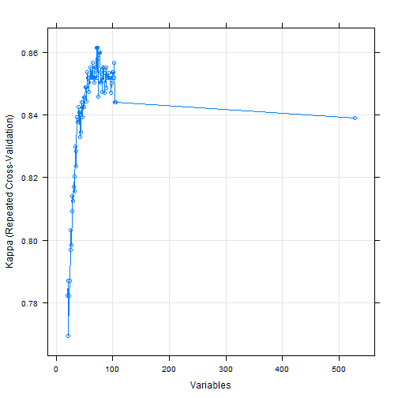

# "Weight Lifting Exercise:Recognition of Common Patterns"
##author: "Vitalij Vasil'ev"


#Summary
 Researches have conducted various studies involving measurements of supervised human activities. 
 The goal is often classification and recognition of activity type. 
 This assignment is a subsequent analysis of HAR Weight Lifting Exercises[1] data. 
 Unilateral dumbbell biceps curls were performed by 6 male subjects in each of forms: exactly according to the specification (Class A), throwing the elbows to the front (Class B), lifting the dumbbell only halfway (Class C), lowering the dumbbell only halfway (Class D) and throwing the hips to the front (Class E). 
Human activity recognition project has published data from inertial measurement units, gyroscope and magnetometer at a joint sampling rate of 45 Hz. with activity labels and additional variables. 
 For each of the 4 sensors E. Velloso et. al [1] have calculated 24 features. 

 The problem is to classify the activities in a sample without labels. In other words, to build a model based on measured variables and to predict Classe variable.
 
#Exploratory plots 
The researchers have used sliding window approach with 5 fixed window sizes ranging from 0.5s to 2.5s.
"num_window" is the id variable for each window. The data was originally divided by "user_name" and "classe" in chronological order and then split into time windows.
num_window and new_window variables were introduced  as result of feature extraction. Randomly splitting the dataset afterwards causes data leakage.
The variables are readings from sensors derived variables and summary statistics. There are missing values in summary statistics columns.




The gravity component of acceleration on z axis is apparent. 3 dummy variables were introduced which divided the participants into 3 sets:"error in class D", "low acceleration on belt.z", "high acceleration on belt.z".

# Data processing and feature extraction 
 
The complete dataset was split into training and required quiz sets by num_window with respect to overlap. 
The R code in appendix section applies a high pass filter [2] to frequency domain signal for each window.
Peak frequencies were extracted analytically assuming constant sampling rate. Total number of features:855.
The features included in the model are summary statistics and signal peak frequencies for each num_window.


```r
mydata$training<-mydata$training%>%
        mutate(partition=ifelse(
                num_window%in%c(mydata[[2]][,7]-1,mydata[[2]][,7],mydata[[2]][,7]+1),
                "testing",partition)
        )
names(mydata$testing)[160]<-"classe"
mydata$testing$classe<-"A"

mydata$testing<-bind_rows(
        mydata$testing,mydata$training%>%
                dplyr::filter(partition=="testing"))
mydata$training<-mydata$training%>%
        dplyr::filter(partition!="testing")


# hide the labels
```

```r
quizid<-data.frame(mydata$testing$X,num_window=mydata$testing$num_window)
newid<-0-sample(10000,n_distinct(mydata$testing$num_window))

j=0
for (i in unique(mydata$testing$num_window))
{
        j<-j+1
        mydata$testing$num_window[mydata$testing$num_window==i]<-newid[j]
        quizid$num_window[quizid$num_window==i]<-newid[j]
}
mydata$testing$classe<-"A"


mydf<-bind_rows(
        lapply(mydata,function(x)
        {
                x<-x[,which(sapply(x,function(y) which(any(complete.cases(y))))>0)]
                x%>%dplyr::select(-partition)
        }
        )
)
```

#Feature selection
The training partition was scaled and centered. The missing values were imputed using k nearest neighbors algorithm [3]. 
Near zero variance variables were eliminated (99/1 ratio, minimum 4 unique values).
Recursive feature elimination [4] [5] function (caret package) was called on the processed data as a wrapper[6].
 The parameters include metric: Cohen's kappa[7] coefficient, random forests[8] classification and 10 fold repeated cross-validation.
72 features were selected. All of them were summary statistics. 


```
## $mar
## [1] 5.1 4.1 4.1 2.1
## 
## $pty
## [1] "m"
```



Where p_o is relative observed agreement ratio, N is number of ranked rows, n_k_i is the number of times rater i predicted category k.



# Training the classifier
Random forests[8] classifier (caret package) was trained with RFE wrapper.
Random forests algorithm uses bagging and decision trees.

 For each sample it grows a decision tree. At each candidate split it selects a random subset of features.  Then it takes the majority vote from the decision trees.
 
# Conclusion
Cross-validation Kappa=0.86, Accuracy=0.89
Random forests algorithm is robust to outliers and noisy data. The classifier doesn't need to be trained for new participants. 
Out of sample error rate is estimated somewhat lower because of small sample size.

# Appendix


```r
library(caret)
library(e1071)
library(randomForest)
library(parallel)
library(doParallel)
library(data.table)
library(dplyr)
library(tidyr)
library("numDeriv")
library(data.table)
library(signal)
library(anytime)
set.seed(654)
cf<-cheby2(2,1,c(0.4,0.8),type="high")

spectral.peak<-function(k,num=1)
{
        tryCatch(#Code by javlacalle, edited by Yuri Robbers
                #https://stats.stackexchange.com/questions/120663/
                {
                        sp<-spectrum(k,plot=F)  
                        #high pass filter
                        sp$spec<-filtfilt(cf, sp$spec)
                        
                        f <- function(x, q, d) spline(q, d, xout = x)$y
                        x <- sp$freq
                        y <- (sp$spec)
                        nb <- 10 # choose number of intervals
                        
                        iv <- embed(seq(floor(min(x)), ceiling(max(x)), len = nb), 2)[,c(2,1)]
                        
                        # The function "f" is maximized at each of these intervals
                        gr.thr <- 0.1
                        hes.thr <- 0.03
                        vals <- matrix(nrow = nrow(iv), ncol = 3)
                        grd <- hes <- rep(NA, nrow(vals))
                        for (j in seq(1, nrow(iv)))
                        {
                                opt <- optimize(f = f, maximum = TRUE, interval = iv[j,], q = x, d = y)
                                vals[j,1] <- opt$max
                                vals[j,3] <- exp(opt$obj)
                                grd[j] <- grad(func = f, x = vals[j,1], q = x, d = y)
                                hes[j] <- hessian(func = f, x = vals[j,1], q = x, d = y)
                                if (abs(grd[j]) < gr.thr && abs(hes[j]) > hes.thr)
                                        vals[j,2] <- 1
                        }
                        vals[,1] <- round(vals[,1], 2)
                        if (anyNA(vals[,2])) {
                                peaks <- unique(vals[-which(is.na(vals[,2])),1])
                        } else {
                                peaks <- unique(vals[,1])}
                        ifelse(length(complete.cases(peaks))<num|all(is.na(vals[,2])),-1,
                               peaks[num])
                },
                error =function(x){0}
        )        
}
spectral.peak2<-function(x){spectral.peak(x,2)}
col.complete<-function(y)
{
        apply(y, 2, function(z){ all(complete.cases(z))})
}
mydata<-list(training=data.frame(),testing=data.frame())
for (i in seq_along(mydata))
{        
        mydata[[i]]<-read.csv(
                file=names(mydata)[i],
                stringsAsFactors = F,na.strings = c("NA","<NA>","NaN", "#DIV/0!",""," ")
        )
        mydata[[i]]$partition<-names(mydata)[i]
        
}
mydf0<-mydf%>%dplyr::filter(new_window=="yes")
mydf1<-mydf%>%dplyr::filter(new_window=="no")
cols1<-which(col.complete(mydf1))
mydf1<-mydf1[,cols1]
mydf1<-bind_rows(mydf1,mydf0[,cols1])
mydf2<-mydf[,which(sapply(mydf,function(x) {length(which(complete.cases(x)))})>=n_distinct(mydf$num_window))]
mydf3<-mydf[,c(2,7,154,which(sapply(mydf,function(x) {length(which(complete.cases(x)))})<n_distinct(mydf$num_window)))]
mydf3<-mydf3[which(complete.cases(mydf3$var_roll_forearm)),]
mydf3<-mydf3[,which(grepl("(amplitude|num_win|classe|user_name)",names(mydf3)))]
at<-which(names(mydf2)%in%names(mydf2)[-grep("(window|time|user|classe|^X$)",names(mydf2))])
mydf2<-merge(by="num_window",all=T,
             mydf2%>%
                     dplyr::select(classe,num_window,user_name)%>%
                     group_by(num_window)%>%
                     summarise_all(unique),
             mydf2%>%
                     group_by(num_window)%>%
                     summarise_at(at,funs(mean,min,max,var,kurtosis,skewness,sd,median))
)
at<-which(names(mydf1)%in%names(mydf1)[-grep("(window|time|user|classe|^X$)",names(mydf1))])
mydf1<-merge(by="num_window",all=T,
             mydf1%>%
                     dplyr::select(classe,num_window,user_name)%>%
                     group_by(num_window)%>%
                     summarise_all(unique),
             mydf1%>%
                     group_by(num_window)%>%
                     summarise_at(at,funs(spectral.peak,spectral.peak2))
)
mydf<-merge(mydf1,mydf2,all=T,by="num_window")
all.equal(mydf$classe.x,mydf$classe.y)
all.equal(mydf$user_name.y,mydf$user_name.x)
mydf<-as.data.frame(mydf%>%dplyr::select(-classe.y,-user_name.y))

mydf<-merge(mydf,mydf3,all=T,by="num_window")
all.equal(mydf$classe,mydf$classe.x)
all.equal(mydf$user_name,mydf$user_name.x)
mydf<-as.data.frame(mydf%>%dplyr::select(-classe,-user_name))

for(i in ncol(mydf))
{
        mydf[,i][which(grepl("(nan|NaN|Inf|INF|div|NAN|inf|Div|DIV)",mydf[,i]))]<-NA
}
mydf<-mydf%>%
        mutate(bias=as.factor(ifelse(user_name.x=="eurico","class.D.error",
                                     ifelse(user_name.x%in%c("adelmo","charles","pedro"),"low.acc.z","high.acc.z"))))
dum<-dummyVars(~bias,data=mydf) 
kk<-as.data.frame(predict(dum,mydf))
mydf<-mydf%>%
        select(-bias)%>%
        bind_cols(kk)%>%
        dplyr::mutate(bias.high.acc.z=ifelse(user_name.x=="eurico",1,bias.high.acc.z))
training<-mydf%>%
        dplyr::filter(num_window>0)
quiz<-mydf%>%
        dplyr::filter(num_window%in%quizid$num_window[which(quizid$mydata.testing.X<=20)])
quiz$X<-0
for (i in 1:nrow(quiz)){quiz$X[i]<-quizid$mydata.testing.X[which(quizid$num_window==quiz$num_window[i])]}
quiz<-quiz%>%arrange(X)
y<-training[,which(names(training)=="classe.x"),drop=FALSE]
y$classe.x<-as.factor(y$classe.x)
training1<-training%>%
        dplyr::select(-user_name.x,-num_window,-classe.x)

#separate imputation for training partition or data will be leaked
```

```r
cluster <- makeCluster(detectCores() - 0) 
registerDoParallel(cluster)
preproc<-preProcess(training1,method = c("nzv","knnImpute","center","scale"),
                    thresh = 0.99,freqCut = 99/1,uniqueCut = 3)
trainingpre<-predict(preproc,training1)
#trainingpre<-trainingpre[nearZeroVar(trainingpre,uniqueCut = 1)]
#feature selection examples by About Jason Brownlee
#http://machinelearningmastery.com/feature-selection-with-the-caret-r-package/
# define the control using a random forest selection function
control <- rfeControl(functions=rfFuncs, method="repeatedcv", number=10,allowParallel=T,verbose = T)
# run the RFE algorithm
```

```r
results <- rfe(metric = "Kappa",trainingpre,y$classe.x, sizes=c(20:floor(ncol(trainingpre)/5)), rfeControl=control)
# summarize the results
print(results)
# list the chosen features
predictors(results)
# plot the results
plot02<-plot(results, type=c("g", "o"))
stopCluster(cluster)
registerDoSEQ()
```

```r
quizpre<-predict(preproc,quiz)
quizrf<-predict(results,quizpre)
```


```r
apply(quizrf[which(quiz$num_window%in%quizid$num_window[1:20]),2:6],1,which.max)
```

```
##  1  2  3  4  5  6  7  8  9 10 11 12 13 14 15 16 17 18 19 20 
##  1  1  1  3  1  5  4  1  1  1  2  3  2  1  5  5  1  2  1  2
```


#References:
[1] E. Velloso, A. Bulling, H. Gellersen,W. Ugulino, H. Fuks. Qualitative Activity Recognition of Weight Lifting Exercises. 

[2] Richard W. Daniels (1974). Approximation Methods for Electronic Filter Design. New York: McGraw-Hill. ISBN 0-07-015308-6.

[3] D. Coomans, D.L. Massart (1982). "Alternative k-nearest neighbour rules in supervised pattern recognition : Part 1. k-Nearest neighbour classification by using alternative voting rules". Analytica Chimica Acta.

[4] Gareth James, Daniela Witten, Trevor Hastie, Robert Tibshirani . An Introduction to Statistical Learning. Springer.(2013) p. 204.

[5] I. Guyon A. Elisseeff An Introduction to Variable and Feature Selection Journal of Machine Learning Research 3 (2003) 1157-1182

[6] M. A. Hall. Correlation-based Feature Subset Selection for Machine Learning . PhD thesis, Department of Computer Science, University of Waikato, Hamilton, New Zealand, 1999.

[7] J. Cohen,  "A coefficient of agreement for nominal scales". Educational and Psychological Measurement.(1960) 20 (1): 37–46. 

[8] L. B. Statistics and L. Breiman. Random forests. In Machine Learning , pages 5–32, 2001.
